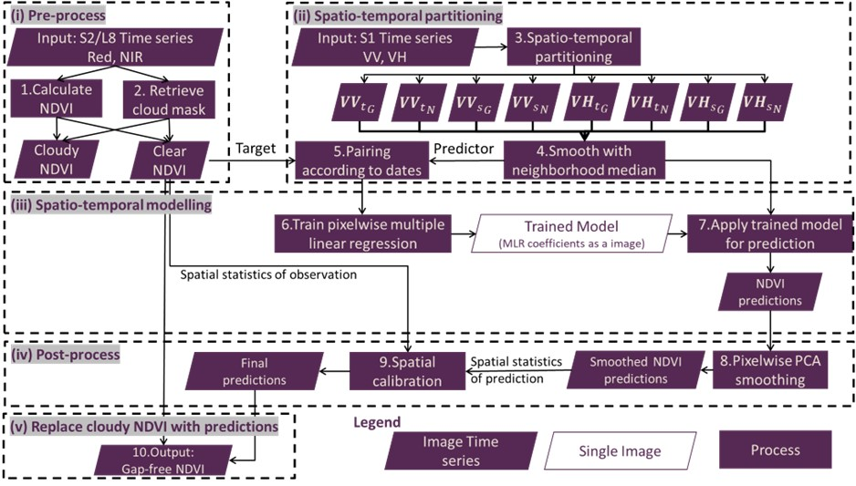

# Reconstructing cloud-contaminated satellite images with SAR-Optical fusion using spatio-temporal partitioning and multiple linear regression 
Python scripts fusion_GEE.py achieves this objective. 
All outputs will be exported to the Google Drive linked to the GEE account.
## Description
- fusion_GEE.py performs GEE-based optical-SAR fusing. It retrieves optical and SAR satellite images from GEE for an user-specified period and AOI, predicts cloudy optical images with corresponding SAR images which are not affected by cloud, and outputs infilled optical images.
- Parameters.json in config folder contains the configuration for all environmental and model parameters.
- The shape or json files in AOI folder contains all case study sites as below:

| Name               | Landcover and Natural                                                         | Area (km^2) | Site Central Longitude (°E) | Site Central Latitude (°S) |
|--------------------|-------------------------------------------------------------------------------|-------------|-----------------------------|----------------------------|
| North NT           | Conservation environments and irrigated perennial horticulture                | 24          | 131.2                       | -12.59                     |
| Central West NSW   | Grazing native vegetation and dryland cropping                                | 16          | 148.77                      | -31.32                     |
| Central Tas        | Grazing modified pasture and irrigated cropping                               | 7           | 147.51                      | -41.92                     |
| South West Qld     | Irrigated cropping                                                            | 10          | 145.73                      | -27.94                     |
| East Gippsland Vic | Production native forests and grazing modified pastures affected by bush fire | 5           | 148.43                      | -37.64                     |
| North Qld          | Sugar cane with surrounding rainforest                                        | 19          | 145.8                       | -17.05                     |
| Wheatbelt WA       | Dryland cropping, wheat, oats and pasture                                     | 19          | 117.26                      | -32.89                     |

## Flow charts
- SAR-OPT_fusion

## Scability
- The algorithm was implemented on Google Earth Engine with a standard (free) account, and the resultant images were exported to Google Drive. Details about the time and storage cost under several different scenarios were summarized below:

| Scenario | Image size (pixels) | Number of images | Training and prediction time (mins) | Post-process time (mins)           | Size of images to reconstruct |
|----------|---------------------|------------------|-------------------------------------|------------------------------------|-------------------------------|
| 1        | 248 × 240           | 207              | 2                                   | 9                                  | 87.22 MB                      |
| 2        | 500 × 414           | 437              | 10                                  | 60                                 | 802.36 MB                     |
| 3        | 2750 × 4671         | 380              | 40                                  | Failed (Exceeded GEE memory limit) | 34.66 GB                      |

- For application at large spatio-temporal extents, we suggest to: 
  1. use other smoothing methods (e.g., spatial instead of temporal smoothers) for post-processing; 
  2. download the raw predictions and smooth the data locally according to requirements; 
  3. process the large area/timespan as small batches; and/or (iv) apply for larger memory limits from GEE.

## Installation
To use GEE, you must first *[sign up](https://earthengine.google.com/signup/)* for a *[Google Earth Engine](https://earthengine.google.com/)* account.

The project requires earth-engine-api and few other packages to be installed.
A conda environment with the required dependencies can be created with
```bash
conda create -n GEE_SAR_OPT python = 3.7
conda activate GEE_SAR_OPT
pip install earthengine-api
pip install geopandas
pip install pandas
pip install json
```
To authenticate and initialize ee
```bash
import ee
ee.Authenticate()
ee.Initialize()
```
## Usage
The setup and parameters can be tuned in the Parameters.json in config folder.
To implement the gap infilling
```bash
cd scripts
python fusion_GEE.py
```
## Output Dataset Paths
Output images and metadata will be saved in a Google Drive folder named according to the parameter "PROJECT_TITLE". 
GEE will search for the folder name on Google Drive from root to sub directories.
If the folder has already existed in a subdirectory, outputs will be saved there, 
otherwise, GEE will create a new folder under the root path.
## Credits
This project was funded by CSIRO Digiscape FSP. It involved Yongjing Mao, Tim McVicar and Tom Van Niel.


