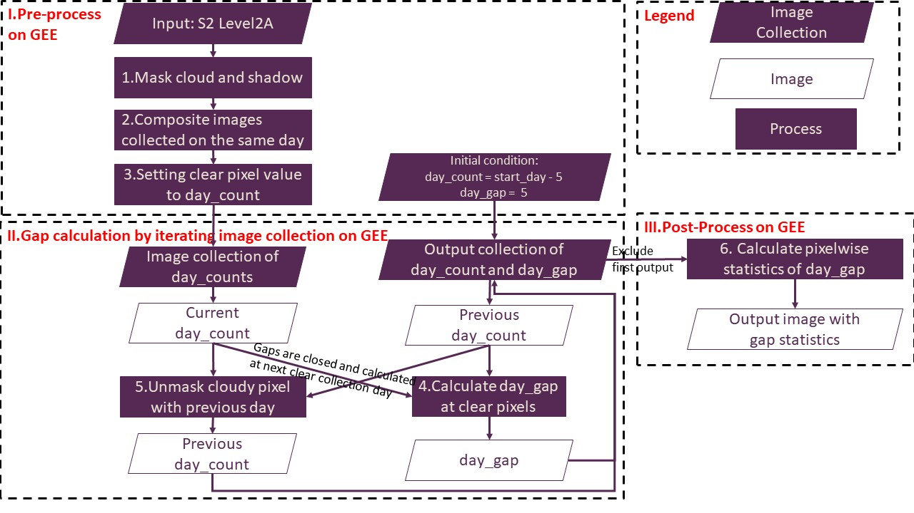
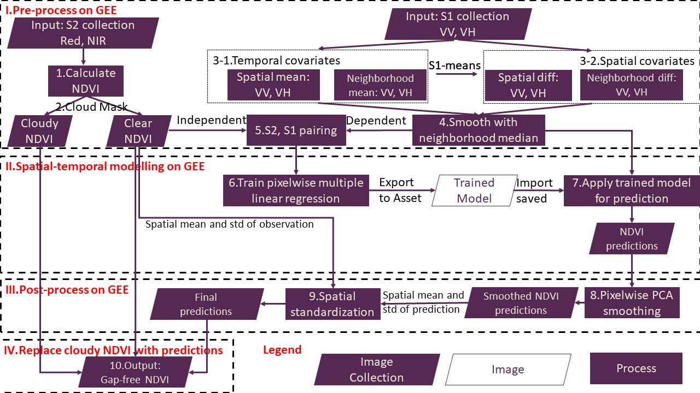

# Infilling gaps of Sentinel-2 (or Landsat-8) images using Sentinel-1 based modelling on GEE
This Google Earth Engine (GEE) based project includes two objectives: 1. Characterize gaps in optical satellite images (Sentinel-2 and Landsat-8); 2. Infill gaps with Sentinel 1 SAR images.
Python scripts GEE_Optical_Gaps.py and GEE_Optical_Infilling.py achieve these two objectives respectively and independently. 
All outputs will be exported to the Google Drive linked to the GEE account.
## Description
- GEE_Optical_Gaps.py performs GEE-based pixelwise gap analysis. It retrieves satellite images from GEE for an user-specified period and Area of interest (AOI) and outputs pixelwise statistics of gaps between clear days.
- GEE_Optical_Infilling.py performs GEE-based optical-SAR fusing. It retrieves optical and SAR satellite images from GEE for an user-specified period and AOI, predicts cloudy optical images with corresponding SAR images which are not affected by cloud, and outputs infilled optical images.
- Test folder contains input AOIs and images as well as output images that can be used for integration testing. 
  - In subfolder "Gap_Characterizing": "Mask_Input" as well as "InputMask_Metadata" can be used to reproduce "Gap_Statistics" and test the GEE_Optical_Gaps.py.
  Input images are saved as multiband images with bandname corresponds to the id of image in the satellite mission. Output images are save as multiband images with bandname correponse
  to a statistical parameter.
  - In subfolder "Gap_Infilling": "NDVI_Input", "VV_Input", "VH_Input" and "NDVI_Mask" as well as "InputNDVI_Metadata" and "InputS1_Metadata" can be used to reproduce "NDVI_gapfree" and
test the GEE_Optical_Infilling.py. Both input and output images are saved as multiband images with bandname corresponds to the id of image in the satellite mission. 
  - The suffix of each filename is in the format of "OpticalMission_StartDate_Enddate".
## Flow charts
- GEE_Optical_Gaps

- GEE_Optical_Infilling

## Challenges
- GEE_Optical_Gaps.py has been fully (all avaiable images selected) tested for AOIs less than 100 km x 100 km (1e8 pixels),
larger AOIs may need to be divided into smaller tiles.
- Although GEE_Optical_Infilling.py sets the maximum pixels to 1e9, GEE_Optical_Infilling.py has only been fully tested on a small AOI (e.g. 5 km * 3 km, 1.5e5 pixels), 
which took 3 (1) hours to run, and 300 MB (200 MB) to store data for Sentinel-2 (Landsat-8). 
We explored the capability of this model at an entire Landsat-8 WRS2 tile (185 km x 180 km, 3.3e8 pixels). 
it took about 10 hours to train the model for Landsat-8 and consumed more than 20 GB to save the trained model as an intermediate output
(we did not compelete the entire process and exported final outputs due to shortage of storage).
## Installation
To use GEE, you must first *[sign up](https://earthengine.google.com/signup/)* for a *[Google Earth Engine](https://earthengine.google.com/)* account.

The project requires earth-engine-api and geojson to be installed.
A conda environment with the required dependencies can be created with
```bash
conda create -n GEE_Opt_SAR_blending python = 3.7
conda activate GEE_Opt_SAR_blending
pip install earthengine-api
pip install geojson
```
## Usage
The setup and parameters can be tuned directly in the GEE_Optical_Gaps.py and GEE_Optical_Infilling.py.

To implement the gap characterizing
```bash
python GEE_Optical_Gaps.py
```

To implement the gap infilling
```bash
python GEE_Optical_Infilling.py
```
## Dataset Paths
Output images and metadata will be saved in a Google Drive folder named according to the parameter "PROJECT_TITLE". 
GEE will search for the folder name on Google Drive from root to sub directories.
If the folder has already existed in a subdirectory, outputs will be saved there, 
otherwise, GEE will create a new folder under the root path.
## Credits
This project was funded by CSIRO Digiscape FSP. It involved Yongjing Mao, Tim McVicar and Tom Van Niel.


